# 离线管道完整 Python 函数调用路线（v6.11）

> 覆盖四家公司 2023–2025 金融投资研究交付的正式生产路径：
> Canonical PDF → 主表解析 → CertifiedChildTableLink → Whole-table Capture →
> Capture 认证决策 → Canonical Long → Merge → 用户研究 XLSX。
> 行号以 `releases/v6.11` 当前代码为准，随代码演进可能漂移。

## 0. 总体流程

```mermaid
flowchart LR
    A[Canonical PDF] --> B[GenericDiscoveryService.discover<br/>主报表发现/解析]
    B --> C[DiscoveryService<br/>build_occurrence / rank / adjudicate]
    C --> D[HierarchicalChildTableDiscoveryService<br/>discover→enrich→link→assign_global]
    D --> E[ChildCaptureExecutionService<br/>create_execution_batch]
    E --> F[GuidedCaptureService.execute<br/>CaptureOrchestrator]
    F --> G[capture_named_table_spatial<br/>Whole-table Capture]
    G --> H[CaptureCompletionService / CaptureDecisionReducer<br/>Capture 认证决策]
    H --> I[table_merge.create_merge_project<br/>Canonical Long]
    I --> J[write_merge_outputs<br/>Merge + 用户研究 XLSX]
```

## 1. 入口

| 入口 | 位置 | 说明 |
| --- | --- | --- |
| `main()` | `tools/run_four_company_stage_b_revalidation.py:733` | 12 份年报离线验收；默认使用私有 scratch 库，`--execute-stage-b` 时走正式执行路径 |
| `build_backend_services(paths)` | `backend_context.py:52` | 构建服务图（Registry、Discovery、Orchestrator、Merge、ChildCaptureExecutionService） |

离线入口对每份 filing 依次执行：
`GenericDiscoveryService.discover` → `choose_occurrence` →
`DiscoveryService.build_occurrence` → `create_anchor_children` →
逐子表 `discover` / `enrich_top_k` / `link_candidates` → `assign_global` →
`_execute_stage_b_filing`（`run_four_company_stage_b_revalidation.py:519`，内部调用
`ChildCaptureExecutionService.create_execution_batch`）。

## 2. 阶段 1：主报表发现与解析（Main Statement Resolution）

1. `GenericDiscoveryService.discover(pdf_path, definition_id, company, report_year)`
   — `generic_discovery_engine.py:29`
   - 按 Research Definition 的表族策略分发：
     - `_statement_strategy(...)`（`STATEMENT_PARENT_TO_MULTI_NOTE` 等）
     - `_direct_note_family(...)` / `_direct_disclosure(...)`
   - 主表结构解析：`StatementFamilyResolver().resolve_discovered_rows(...)`
     （`generic_discovery_engine.py:274`，`statement_family_resolution.py`）
   - 候选转 occurrence：`self.structure_parser.parse(candidates, ...)`
     （`generic_structure_parser.py`）
2. `DiscoveryService.build_occurrence(...)` — `services/discovery_service.py:44`
   （规范化 occurrence，注入 `pdf_id`，保留 `child_rows`）
3. `DiscoveryService.rank_anchor_candidates(occurrences, scope_preference, required_scopes)`
   — `services/discovery_service.py:71`（每 PDF×口径推荐/预选一个 Anchor）
4. `DiscoveryService.adjudicate_anchor(occurrence_id, label="ACCEPTED", ...)`
   — `services/discovery_service.py:208`（写 `anchor_adjudications`、
   `statement_occurrences.status=ANCHOR_CERTIFIED`；UI 前置 Golden 门禁
   `golden_acceptance.compare_statement_anchor`）
5. `DiscoveryService.resolve_note_targets(occurrence)` — `services/discovery_service.py:151`

## 3. 阶段 2：CertifiedChildTableLink（候选发现 → inventory → 认证）

1. `ChildDiscoveryRepository.create_anchor_children(anchor, research_definition_id, definition_version)`
   — `hierarchical_child_discovery.py:363`（由定义生成子表概念，写 `anchor_child_concepts`）
2. `HierarchicalChildTableDiscoveryService.discover(pdf, anchor, concept, contract, scope)`
   — `hierarchical_child_discovery.py:2416`（Tier1/2/3 候选；`FinancialNoteIndexService` 索引）
3. `HierarchicalChildTableDiscoveryService.enrich_top_k(pdf, concept, candidates, contract)`
   — `hierarchical_child_discovery.py:2786`
   - 内部规划同附注 inventory：`_save_candidate_inventory(...)`
     （`child_note_table_inventories` / `child_logical_table_candidates`，
      `hierarchical_child_discovery.py:1095` 附近）
4. `HierarchicalChildTableDiscoveryService.link_candidates(anchor, concept, enriched, contract)`
   — `hierarchical_child_discovery.py:2963`（生成 link candidates）
5. `HierarchicalChildTableDiscoveryService.assign_global(anchor_id, scope, links_by_child)`
   — `hierarchical_child_discovery.py:3424`
   - 逐子表：`_auto_certify_inventory_links(chosen, links)`
     （`hierarchical_child_discovery.py:3231`）
     - 容器复用（INC-017 修复）：`_adopt_existing_container_links(...)`
       （`hierarchical_child_discovery.py:3141`）
     - `repo.certify_note_table_inventory(...)`（写 `certified_note_table_inventories`）
     - `repo.certify(payload, ...)`（写 `certified_child_table_links`，即
       CertifiedChildTableLink；含 certified segments / logical table / inventory 身份）
   - 产出 `assignment["certified_links"]` 与 per-child decisions。

## 4. 阶段 3：Stage B 执行（离线/UI 共用）

1. `ChildCaptureExecutionService.preview_capture_plans(certified_links, source_pdf_map, research_definition, scope)`
   — `services/child_capture_execution_service.py:405`（只读预览，persist=False）
2. `ChildCaptureExecutionService.create_execution_batch(...)` — 同文件 `:1018`
   - `prepare_capture_plans(persist=True)`（同文件 `:230` 附近）：
     - `_strict_links_to_plans(...)`（同文件 `:1493`）→ `ensure_capture_plan`
       （写 `capture_plans` / `capture_plan_items`）
     - 会话版本化：`persist_capture_scope` / `_create_versioned_session` /
       `restore_execution`（`stage_b_execution_sessions`）
   - 每份计划：`_plan_for_capture_scope(...)`（按
     `capture_scope_policy` / `selected_logical_table_ids` 裁剪）
     → `guided_capture.execute(execution_plan, pdf_path, research_batch_id, options)`
   - 落库：`research_batches` / `research_batch_members`（PLAN、SOURCE_BATCH）

## 5. 阶段 4：Whole-table Capture

1. `GuidedCaptureService.execute(plan, pdf_path, batch_id, research_batch_id, options)`
   — `services/guided_capture_service.py:26`
   - 逐 READY NOTE_DETAIL 生成 `CaptureRequest.new(capture_mode=CERTIFIED_TARGET, ...)`
   - 提交：`capture_service.submit_batch(requests, batch_id, max_workers, asynchronous=True)`
2. `jobs/table_capture_runner.py`：`enqueue` → 后台线程 `_run_one(job)`
   （`table_capture_runner.py:170`）→ `CaptureService.execute_queued_request(request)`
   （`services/capture_service.py:1058`）→ `CaptureOrchestrator.execute(request)`
3. `CaptureOrchestrator.resolve(request)` — `capture_orchestrator.py:39`
   - `StrategyRegistry` 选择策略（`discovery_strategies.py`：
     `CertifiedTargetStrategy` / `ManualCertifiedRoiStrategy` /
     `DirectQueryStrategy` / `RegistryDiscoveryStrategy`）
   - `discover_candidates` → `rank_candidates` → `resolve_target` →
     `validate_target` → `ResolvedCaptureTarget`
4. `CaptureOrchestrator.execute(request, target)` — `capture_orchestrator.py:83`
   - `CaptureService._execute_resolved_target(request, target)`
     （`services/capture_service.py:1273`）→ `_create_legacy(...)`
     （`services/capture_service.py:1310`）
5. 表抓取原语：
   - `capture_named_table(...)` — `table_capture.py:882`
     - 空间模式：`spatial_table_capture.capture_named_table_spatial(...)`
       （`spatial_table_capture.py:4550`）
       - `locate_table_roi(...)`（`spatial_table_capture.py:3340`）→
         `table_boundary_resolver.resolve_table_boundary(...)`
       - `_certified_column_context(...)` / `_vertical_period_plan(...)` /
         `_certified_vertical_period_plan(...)`
       - `_arbitrate_header_candidates(...)`（表头仲裁）
       - `_plan_physical_table_segments(...)`（物理段规划）
       - 边界证据：`_candidate_boundary_summary(...)` / `table_boundary_resolver`
     - 兼容回退：`_capture_named_table_legacy(...)`（`table_capture.py:797`）
   - 复合附注拆块：`compound_note_engine.segment_table_blocks(result)`（`:583`）→
     `materialize_block_result(result, block)`（`:776`）→ `serialise_block(...)`（`:828`）
   - 认证 scope 校验与选择：`_validate_certified_scope_governance(...)` /
     `_select_blocks_for_scope(...)`（`services/capture_service.py`）
   - 产物落盘：`write_capture_artifacts(child_dir, child_result)`
     （`table_capture.py:1362`；raw_long/raw_wide/result.json）+
     `capture_library.initialize_capture_library_run(...)`
     （`capture_library.py:1559`；capture_metadata.json）

## 6. 阶段 5：Capture 认证决策（Reducer）

1. `CaptureCompletionService.complete(capture_id, machine_evidence, metadata, ...)`
   — `services/capture_completion_service.py:79`
   - `CaptureDecisionReducer.reduce(machine_evidence, research_definition,
     capture_version, human_adjudications, lifecycle_state, rule_version)`
     — `services/capture_decision_reducer.py:64` → `DecisionResult`
     （quality_status / review_status / certified / asset_status /
     merge_eligible / blocking_issues / non_blocking_warnings / bundle_status）
   - 事务落库：`_get_or_create_logical_asset_in_tx`（`logical_assets`）、
     `_register_capture_version_in_tx`（`capture_versions`）、
     `ReviewTaskService.materialize_decision_in_tx`（`review_queue`）、
     `_recalculate_bundle_status_in_tx`（`capture_bundle_children`）
   - `_project_capture_metadata(...)` → `capture_metadata.json`
2. `CaptureOrchestrator.execute` 按 `decision.merge_eligible` 收尾：
   `lifecycle.transition(SUCCESS | REVIEW_REQUIRED)`、
   `repo.update_request(...)`、`repo.recalculate_bundle_status(...)`

## 7. 阶段 6：Canonical Long + Merge

1. `MergeService.create(...)` — `services/merge_service.py:552`
   - 资格校验：`MergeEligibilityService`（`services/asset_governance_services.py:255`，
     内部 `AssetQueryService.merge_eligible`）
   - `table_merge.create_merge_project(capture_dirs, metadata_rows, output_dir,
     table_id, taxonomy_path, merge_lineage)` — `table_merge.py:1818`
2. `create_merge_project` 内部：
   - 每 capture：`infer_capture_metadata(capture_dir)`（`table_merge.py:211`）+
     `load_capture_long(capture_dir, meta, table_id)`（`table_merge.py:626`）
     → `raw_long` 拼接
   - `load_taxonomy(taxonomy_path)`（`:163`）+ `build_mapping_queue(raw_long, table_id, taxonomy)`
     （`:759`）
   - 校验 bundle 展开与行排除：`merge_row_exclusions` / `bundle_expansion`
   - `write_merge_outputs(output_dir, manifest, raw_long, mapping_queue, taxonomy_path)`
     — `table_merge.py:1676`
3. `write_merge_outputs` 内部（Canonical 材料化）：
   - `_repair_manifest_and_raw_periods(...)`（`:450`）
   - `apply_mapping(raw_long, mapping_queue)`（`:847`）
   - `build_structural_order(mapped, manifest)`（`:1113`）
   - `materialize_canonical(mapped, structural_order)`（`:1241`）→
     resolved / wide / conflicts
   - 产出：`merge_canonical_long.csv`、`canonical_research_long.csv`、
     `merge_canonical_wide.csv`、`column_dimensions.csv`、
     `research_wide_metadata.json`、`merge_project.xlsx`
4. `MergeService.refresh(merge_id, persist_taxonomy)`（`:621`）→
   `table_merge.refresh_merge_project(...)`（非破坏性重算派生产物）
5. 公司级 Merge 与四公司研究 Merge：按公司分别 `create_merge_project`，再合并
   各公司 canonical research long 形成四公司研究视图（`family_merge_v63.py` /
   `merge_library.py` 辅助）。

## 8. 阶段 7：用户研究 XLSX

- `write_merge_outputs` 生成 `merge_project.xlsx`（sheet：raw_long、mapping_queue、
  canonical_long、canonical_research_long、resolved_long、presentation wide、
  column_dimensions、conflicts、coverage、structural_order、order_conflicts、
  reconciliation、source_identity_qa）。
- 展示宽表：`write_presentation_wide_sheet(...)`（`table_merge.py:1620`），列维度由
  `VisibleHeaderDimensionPolicy` 编码（`research_wide_metadata.json`）。
- 旧批量路径：`batch_pipeline.py:958` → `batch_results.xlsx`（仅兼容旧流程，不作为
  正式研究交付）。

## 9. 关键数据落库与产物

| 阶段 | 表 / 文件 |
| --- | --- |
| 主表解析 | `statement_occurrences`、`anchor_adjudications`、`anchor_certification_audit` |
| 子表发现 | `anchor_child_concepts`、`thin_child_table_candidates`、`child_note_table_inventories`、`child_logical_table_candidates` |
| 认证 | `certified_note_table_inventories`、`certified_child_table_links`、`certified_child_table_segments`、`certified_note_targets` |
| Stage B | `capture_plans`、`capture_plan_items`、`stage_b_execution_sessions`、`research_batches`、`research_batch_members`、`jobs` |
| Capture | `capture_versions`、`logical_assets`、`review_queue`、`capture_bundle_children`；run 目录 `table_raw_long/wide.csv`、`table_capture_result.json`、`capture_metadata.json` |
| Canonical/Merge | `merge_manifest.json`、`merge_canonical_long.csv`、`canonical_research_long.csv`、`merge_canonical_wide.csv`、`merge_project.xlsx` |

## 10. 与近期修复的挂钩

- INC-016（首次提交持久化）：面板“确认逻辑表并抓取”回传 `certified_links` /
  `source_pdf_map` / `plans`（`components/child_capture_execution_panel.py`），
  首次使用即可原子落库。
- INC-017（重复认证容器冲突）：`_adopt_existing_container_links`
  （`hierarchical_child_discovery.py:3141`）在内容等价 + PDF digest 一致时复用
  既有 certified links，避免 `NOTE_TABLE_INVENTORY_ID_MISMATCH` 死路。
